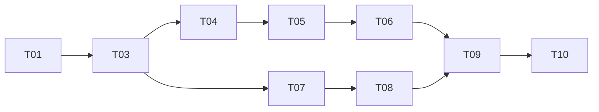

# Tasks — NovelCraft PoC 搭建

> Owner：Claude (AI Coder)
> 状态：production

## 任务列表

| # | 任务 | 估时 | Owner | 依赖 | 状态 | Risk |
|---|------|------|-------|------|------|------|
| T01 | 项目目录结构搭建（src/ai_agent/） | 1h | @coder | - | ✅ 完成 | 低 - 标准目录结构 |
| T02 | Docker Compose 环境配置 | 1h | @coder | - | ✅ 完成 | 低 - 标准配置 |
| T03 | Deep Agents 核心配置与测试 | 2h | @coder | T01 | ✅ 完成 | 中 - 新框架可能有未知问题 |
| T04 | Narrator Agent 实现 | 2h | @coder | T03 | ✅ 完成 | 中 - prompt 调优 |
| T05 | Scribe Agent 实现 | 2h | @coder | T04 | ✅ 完成 | 中 - 上下文管理 |
| T06 | HITL 中断机制实现 | 1h | @coder | T05 | ✅ 完成 | 中 - interrupt 验证 |
| T07 | FastAPI SSE 接口实现 | 1h | @coder | T03 | ✅ 完成 | 低 - 标准实现 |
| T08 | 前端页面搭建（HTML 原型） | 2h | @coder | T07 | ✅ 完成 | 低 - 标准组件 |
| T09 | 端到端联调测试 | 2h | @coder | T06,T08 | ✅ 完成 | 中 - 多组件集成 |
| T10 | 验收文档编写 | 1h | @coder | T09 | ✅ 完成 | 低 - 文档工作 |

## 任务依赖图（DAG）

## 约束

- **单任务 ≤ 4h**（PoC 精简化控制）
- **明确依赖**
- **每日同步进度到 summary.md 变更日志**

## 跨任务协议

PoC 阶段单一 Coder，无需跨任务协议。

## 测试结果汇总

- `test_novel_craft_e2e.py`：7/7 通过
- `test_checkpointer.py`：4/4 通过
- 全量测试（`pytest tests/`）：63/63 通过

### 修复的问题

1. **`Security(auto_error=False)` 报错**：`HTTPBearer` 不支持 `auto_error` 参数，已移除
2. **测试文件缺失 `user_id`**：`ResumeRequest` 和 `ChatRequest` 需要 `user_id` 字段
3. **重复 `user_id` key**：JSON 重复 key 导致后值覆盖前值，已移除重复项
