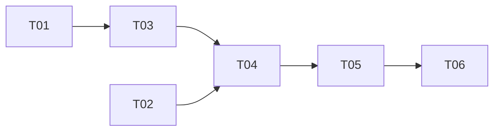

# Tasks — 20260817-redis-checkpointer

> 状态：completed
> TAPD：none
> branch：-

## 任务列表

| # | 任务 | 估时 | Owner | 依赖 | 状态 | Risk |
| --- | --- | --- | --- | --- | --- | --- |
| T01 | 新增 `redis_url` 配置字段 | ≤ 1h | @engineer | - | ✅ done | 低 |
| T02 | docker-compose 新增 Redis 服务 | ≤ 1h | @engineer | T01 | ✅ done | 低 |
| T03 | 实现 `_build_checkpointer()` 工厂函数 | ≤ 2h | @engineer | T01 | ✅ done | 低 |
| T04 | 替换 `MemorySaver` 为 `RedisSaver` | ≤ 1h | @engineer | T03 | ✅ done | 低 |
| T05 | 编写 `test_checkpointer.py` | ≤ 2h | @engineer | T04 | ✅ done | 低 |
| T06 | 代码评审 | ≤ 1h | @reviewer | T05 | ✅ done | 低 |

## 任务依赖图（DAG）

## 约束

- 单任务 ≤ 4h（全部满足）
- 明确依赖（任务 ID，DAG 入边）
- 变更管理：进度同步到 `summary.md` 的「变更日志」段
