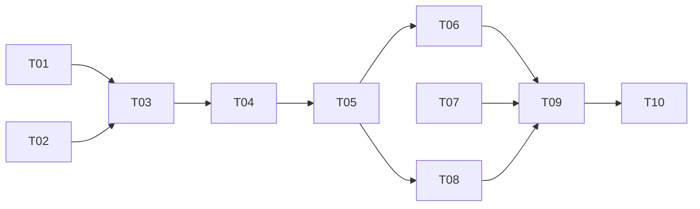

# Tasks — 20260818-style-learning (Phase 2)

> 状态：completed
> TAPD：none
> branch：feat/style-learning

## 任务列表

| # | 任务 | 估时 | Owner | 依赖 | 状态 |
|---|------|------|-------|------|------|
| T01 | docker-compose 新增 Qdrant 服务 | ≤ 1h | @engineer | - | ✅ |
| T02 | `settings.py` 新增 QDRANT_URL 等配置 | ≤ 1h | @engineer | - | ✅ |
| T03 | 实现 `rag/qdrant_client.py` Qdrant 客户端 | ≤ 2h | @engineer | T01,T02 | ✅ |
| T04 | 实现 `rag/style_analyzer.py` 风格特征提取 | ≤ 3h | @engineer | - | ✅ |
| T05 | 实现 Stylist Agent | ≤ 2h | @engineer | T03,T04 | ✅ |
| T06 | 实现 `/api/styles` 端点（列表/上传风格档案） | ≤ 2h | @engineer | T05 | ✅ |
| T07 | 实现 `/api/preferences` 端点（获取/更新偏好） | ≤ 2h | @engineer | - | ✅ |
| T08 | 修改 Scribe Agent 注入风格约束 | ≤ 2h | @engineer | T05 | ✅ |
| T09 | 新增 `test_style_learning.py` 测试 | ≤ 2h | @engineer | T06,T07 | ✅ |
| T10 | 代码评审 | ≤ 1h | @reviewer | T09 | ✅ | |

## 任务依赖图（DAG）

## 约束

- 单任务 ≤ 4h（全部满足）
- 变更管理同步到 `summary.md` 变更日志
