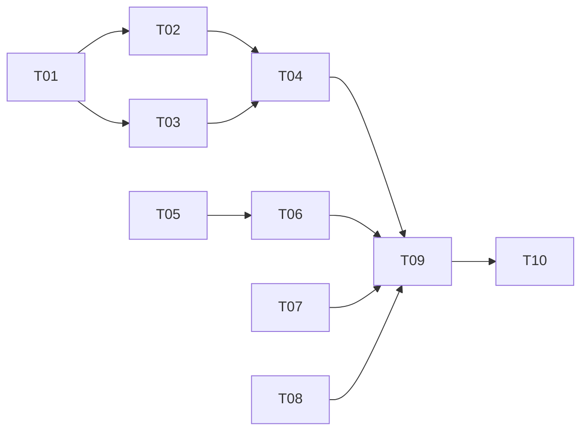

# Tasks — 20260820-phase3-advanced-features (Phase 3)

> 状态：in-progress
> TAPD：none
> branch：feat/phase3-advanced-features

## 任务列表

| # | 任务 | 估时 | Owner | 依赖 | 状态 |
|---|------|------|-------|------|------|
| T01 | 多章节流程设计 - 章节递增/跨章节上下文 | ≤ 2h | @engineer | - | ✅ |
| T02 | 修改 `narrator_node` 支持章节大纲生成 | ≤ 3h | @engineer | T01 | ✅ |
| T03 | 修改 `scribe_node` 支持多章节草稿生成 | ≤ 3h | @engineer | T01 | ✅ |
| T04 | 实现 `POST /api/export` 端点（txt导出） | ≤ 2h | @engineer | T02,T03 | ✅ |
| T05 | 实现 `GET /api/sessions` 列出历史会话 | ≤ 2h | @engineer | - | ✅ |
| T06 | 实现 `GET /api/sessions/{id}` 加载会话 | ≤ 2h | @engineer | T05 | ✅ |
| T07 | 实现大纲编辑端点 `PUT /api/outline` | ≤ 3h | @engineer | - | ✅ |
| T08 | 实现敏感词检测中间件 | ≤ 2h | @engineer | - | ⏳ |
| T09 | 新增 Phase 3 测试用例 | ≤ 3h | @engineer | T04,T05 | ✅ |
| T10 | 代码评审 | ≤ 1h | @reviewer | T09 | ✅ |

## 任务依赖图（DAG）

## 约束

- 单任务 ≤ 4h（全部满足）
- 变更管理同步到 `summary.md` 变更日志
