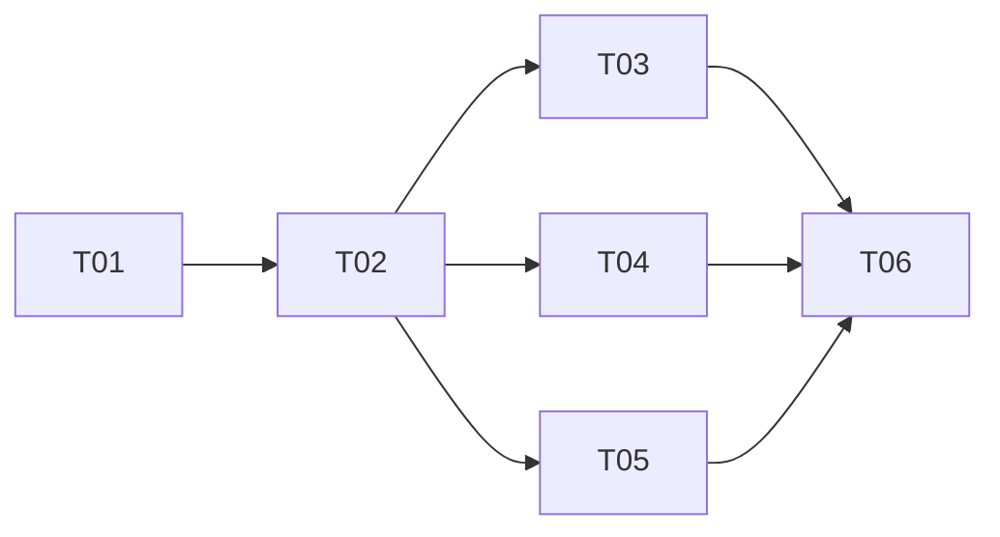

# Tasks — 20260820-subagent-task-delegation (Subagent 任务委派)

> 状态：completed
> TAPD：none
> branch：feat/subagent-task-delegation

## 任务列表

| # | 任务 | 估时 | Owner | 依赖 | 状态 |
|---|------|------|-------|------|------|
| T01 | 设计 Subagent 架构和接口 | ≤ 2h | @engineer | - | ✅ |
| T02 | 实现 Subagent 核心类 | ≤ 3h | @engineer | T01 | ✅ |
| T03 | 实现 Task Tool（主 Agent 调用入口） | ≤ 2h | @engineer | T02 | ✅ |
| T04 | 实现并行执行引擎 | ≤ 2h | @engineer | T02 | ✅ |
| T05 | 实现特殊化配置支持 | ≤ 2h | @engineer | T02 | ✅ |
| T06 | 编写单元测试 | ≤ 2h | @engineer | T03,T04,T05 | ✅ |
| T07 | 集成 Subagent 到 NovelCraft 主 Agent | ≤ 2h | @engineer | T06 | ✅ |

## 任务依赖图（DAG）

## 约束

- 单任务 ≤ 4h（全部满足）
- 变更管理同步到 `summary.md` 变更日志
