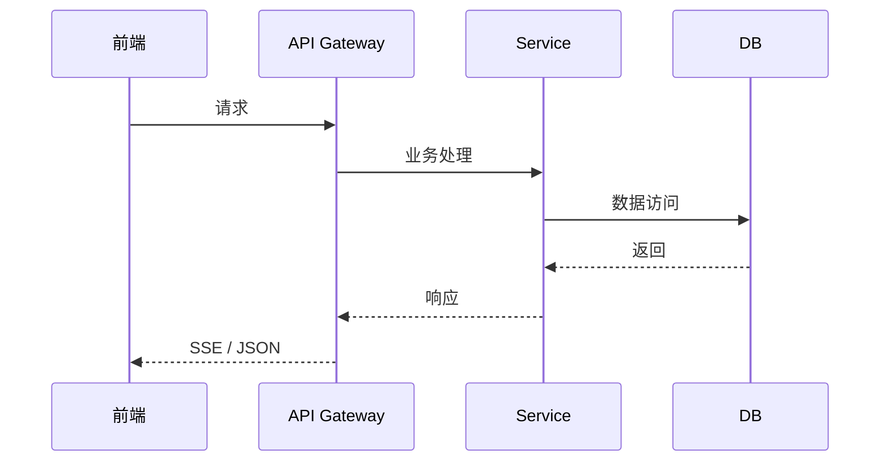

# Design — 方案设计（{feat-name}）

> 模板路径：`.harness/changes/templates/design.template.md`
> 复制到 `.harness/changes/{feat-name}/design.md` 后填写
> 配套文件：`summary.md` / `tasks.md` / `review.md`
> TAPD：{ticket-id}       # 工单号（如无则填 `none`）
> branch：{branch-name}  # 关联分支

## 1. 背景与目标

- 业务背景：
- 技术目标：
- 非目标（明确不做）：

## 2. 架构设计

### 2.1 涉及模块

| 模块 | 现有实现 | 变更说明 |
| --- | --- | --- |
| | | |

### 2.2 数据流（必要时附 Mermaid）



## 3. API 设计

### 3.1 新增 / 变更端点

| 端点 | 方法 | 变更类型 | 描述 |
| --- | --- | --- | --- |
| | | 新增 / 变更 / 弃用 | |

### 3.2 契约差异

| 字段 | v(N-1) | v(N) | 兼容性 |
| --- | --- | --- | --- |
| | | | 向后兼容 / 不兼容 |

## 4. 数据模型变更

### 4.1 新增表 / 字段 / 索引

```sql
-- alembic 迁移概要
ALTER TABLE ...
ADD COLUMN ...
CREATE INDEX ...
```

### 4.2 回滚 SQL

```sql
-- downgrade 概要
ALTER TABLE ...
DROP COLUMN ...
DROP INDEX ...
```

## 5. Prompt 变更（如涉及）

| 模板名 | 旧版本 | 新版本 | 主要变更 |
| --- | --- | --- | --- |
| | | | |

## 6. 关键技术选型

| 决策点 | 选项 | 推荐 | 理由 |
| --- | --- | --- | --- |
| | | | |

## 7. 风险与缓解

| 风险 | 等级 | 缓解措施 |
| --- | --- | --- |
| | 低 / 中 / 高 | |

## 8. 测试策略

- 单元测试：
- 集成测试：
- 端到端测试：

## 9. 监控与告警

| 指标 | 阈值 | 告警渠道 |
| --- | --- | --- |
| | | |