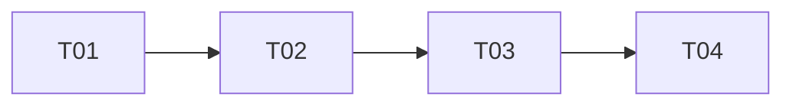

# Tasks — 任务拆分（{feat-name}）

> 模板路径：`.harness/changes/templates/tasks.template.md`
> 复制到 `.harness/changes/{feat-name}/tasks.md` 后填写
> 配套文件：`summary.md` / `review.md` / `design.md`（可选）
> TAPD：{ticket-id}       # 工单号（如无则填 `none`）
> branch：{branch-name}  # 关联分支

## 任务列表

| # | 任务 | 估时 | Owner | 依赖 | 状态 | Risk |
| --- | --- | --- | --- | --- | --- | --- |
| T01 | | ≤ 4h | @coder | - | todo | 低/中/高 + 1 句理由 |
| T02 | | ≤ 4h | @coder | T01 | todo | |
| T03 | | ≤ 4h | @reviewer | T02 | todo | |
| T04 | | ≤ 4h | @owner | T03 | todo | |

## 任务依赖图（DAG）

## 约束

- **单任务 ≤ 4h**（超过必须二次拆，写「必须有 Coder 二次拆」）
- **明确依赖**（任务 ID，DAG 入边）
- **每个任务标 Risk**：低 / 中 / 高 + 1 句理由
- **变更管理**：进度同步到 `summary.md` 的「变更日志」段

## 跨任务协议（如多 Planner）

> 仅在多个 Planner 协调同一变更时填写。

| 协议点 | 谁负责 | 何时 |
| --- | --- | --- |
| | | |