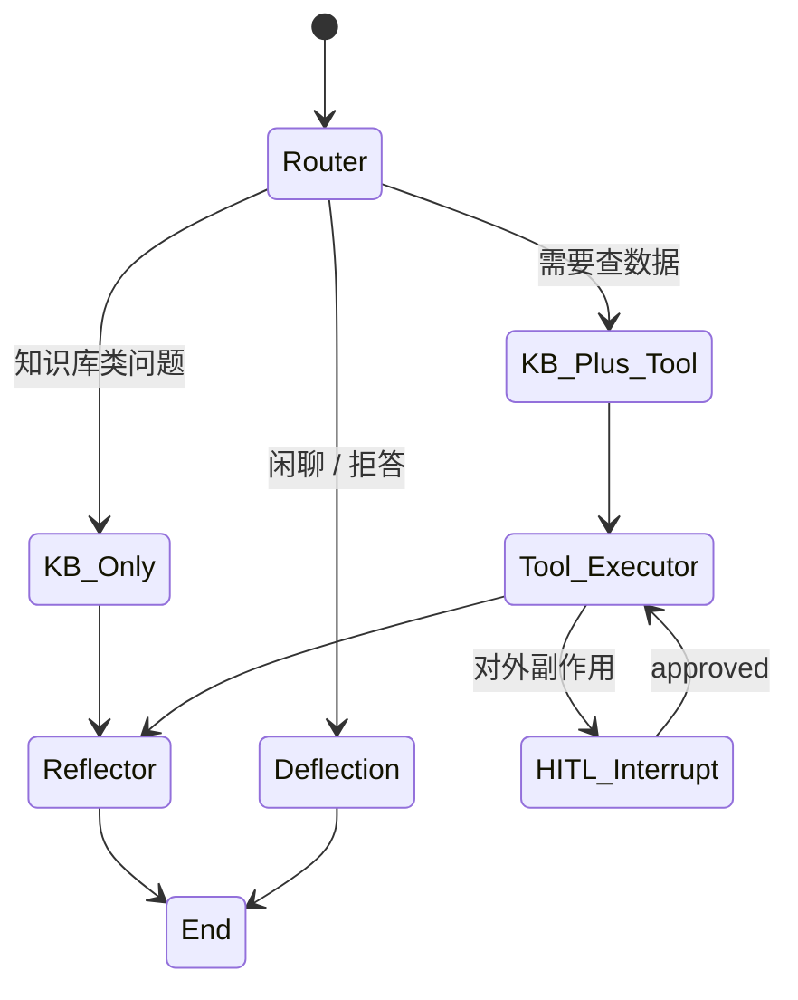

# Agent 模板：智能客服（Customer Service Agent）

> 适用于「多轮对话 + 知识库 RAG + 工单/订单查询 + 工具调用」场景。
>
> 📐 详细架构见 .claude/Claude.md §2 与 .harness/rules/工程结构规范.md

---

## 1. 用户故事

- 用户问："我的订单 #12345 什么状态？"
- Agent：调用 `query_order` 工具 → 拉真实状态 → 友好回答
- 用户问："能换个颜色吗？"
- Agent：调用 `modify_order` 工具（**HITL** 必须）→ 等审批

---

## 2. 状态机



---

## 3. LangGraph 代码骨架

```python
from typing import TypedDict, Annotated
from langgraph.graph import StateGraph, START, END
from langgraph.types import Send, interrupt

class CSState(TypedDict):
    user_id: str
    question: str
    history: list[dict]
    kb_ids: list[str]
    retrieved_chunks: list[dict]
    tool_results: list[dict]
    answer: str
    needs_hitl: bool

def router(state: CSState) -> str:
    q = state["question"].lower()
    if any(kw in q for kw in ["订单", "退款", "物流", "发货"]):
        return "tool_branch"
    return "kb_branch"

def kb_branch(state: CSState) -> dict:
    chunks = retriever.search(
        query=state["question"],
        kb_ids=state["kb_ids"],
        top_k=10,
        rerank=True,
    )
    return {"retrieved_chunks": chunks}

def tool_branch(state: CSState) -> str:
    # LLM 决定调什么工具
    return [
        Send("tool_executor", {
            "tool_name": tool,
            "arguments": args,
            "idempotency_key": uuid4().hex,
        })
        for tool, args in llm_decide_tools(state).items()
    ]

def tool_executor(state) -> dict:
    tool = load_tool(state["tool_name"])
    if tool.requires_hitl:
        approval = interrupt({"tool": state["tool_name"], "args": state["arguments"]})
        if approval.get("action") != "approve":
            return {"tool_results": [{"skipped": True, "reason": "user_rejected"}]}
    result = await tool.arun(**state["arguments"])
    return {"tool_results": [result]}

def reflector(state):
    # 事实校验
    return {"answer": synthesise(state)}

def deflection(state):
    return {"answer": "抱歉，这个问题我暂时帮不了您。"}

builder = StateGraph(CSState)
builder.add_node("router", router)
builder.add_conditional_edges("router", router, {
    "kb_branch": "kb_branch",
    "tool_branch": "tool_branch",
    "deflection": "deflection",
})
builder.add_conditional_edges("router_start", ...)
...
```

---

## 4. Prompt 模板

模板位置：`src/ai_agent/prompts/templates/`

`src/ai_agent/prompts/templates/chat_system_v1.yaml`
```yaml
name: chat_system
version: 1
status: stable
description: 智能客服 Agent 系统提示词
template: |
  你是 {{ agent_name }}，友好专业的智能客服助手。
  
  【用户身份】
  - 用户 ID：{{ user_id }}
  
  【上下文】
  - 对话历史：{{ history | tojson }}
  - 知识库参考资料（按相关度排序）：
    
    - {{ c.content }} (score={{ c.score }})
    
  
  【规则】
  1. 只能基于参考资料或工具返回数据回答。
  2. 未知请明说，不要编造。
  3. 涉及订单/支付/退款的工具调用必须先获得用户确认。
  4. 用 {{ user_language }} 回答。
  5. 输出要简洁，控制在 200 字内。
```

---

## 5. 必备工具

| 工具 | HITL? | 说明 |
| --- | --- | --- |
| `search_knowledge_base` | 否 | RAG 检索 |
| `query_order` | 否 | 查订单状态 |
| `query_user_profile` | 否 | 查用户画像 |
| `modify_order` | **是** | 修改订单 |
| `refund_order` | **是** | 退款 |
| `send_email` | **是** | 发邮件 |
| `human_handoff` | **是** | 转人工 |

---

## 6. 测试要点

- 工具调用成功 / 失败 / 重试
- HITL 拒绝路径
- 拒答路径（闲聊）
- RAG 检索为空时如何应对
- Token 用量限制触发

---

## 7. 监控指标

- Tool 调用成功率 ≥ 99%
- HITL 触发率（人工介入占比）
- 拒答率（Deflection Rate）
- 单次对话成本（中位数 < ¥0.05）

---

*版本：v1.1 — 2026-08-05 混合架构（agent-first）改造：路径 / 业务编排归属改为 agents/*
*上一版本：v1.0（2026-07-31 init）*
