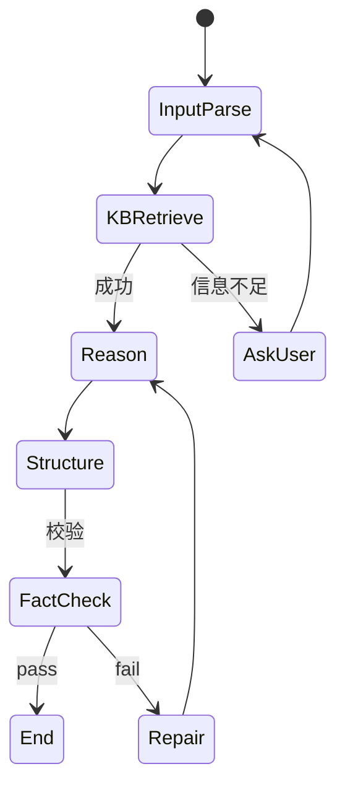

# Agent 模板：专家系统（Expert System）

> 适用于「领域知识深度推理 + 结构化输出 + 规则校验 + 决策建议」场景。
> 典型：医疗诊断辅助、法律咨询、工程参数推荐。
>
> 📐 详细架构见 .claude/Claude.md §2 与 .harness/rules/工程结构规范.md

---

## 1. 用户故事

- 医生问："根据患者症状 [咳嗽/低烧/...], 初步诊断方向？"
- Agent：结构化抽取 → 知识库检索 → 推理链 → Pydantic 输出 → 校验 → 返回

---

## 2. 状态机



---

## 3. LangGraph 骨架

```python
class ExpertState(TypedDict):
    raw_query: str
    structured_query: dict
    retrieved_docs: list[dict]
    reasoning_chain: list[str]
    preliminary_output: dict
    verified_output: dict
    confidence: float

def parse_query(state):
    pyd = QueryParserPrompt | llm.with_structured_output(QueryParse)
    return {"structured_query": pyd.invoke(state["raw_query"])}

def retrieve(state):
    return {"retrieved_docs": retriever.search(**state["structured_query"], top_k=15, rerank=True)}

def reason(state):
    pyd = ReasoningPrompt | llm.with_structured_output(ReasoningChain)
    return {"reasoning_chain": pyd.invoke(state)}

def structure(state):
    pyd = OutputSchemaPrompt | llm.with_structured_output(ExpertOutput)
    return {"preliminary_output": pyd.invoke(state)}

def fact_check(state):
    ok, score = fact_checker.verify(
        output=state["preliminary_output"],
        reference_docs=state["retrieved_docs"],
    )
    if not ok or score < 0.7:
        return {"retry": True}
    return {"verified_output": state["preliminary_output"], "confidence": score}
```

---

## 4. Pydantic 结构化输出

```python
from pydantic import BaseModel, Field

class DifferentialDiagnosis(BaseModel):
    primary: list[Diagnosis] = Field(..., min_length=1)
    secondary: list[Diagnosis] = Field(default_factory=list)
    reasoning: str = Field(..., min_length=50)
    citations: list[Citation]
    confidence: float = Field(..., ge=0, le=1)
    disclaimer: str = "本结果仅为辅助，最终诊断以医生为准。"

class Diagnosis(BaseModel):
    name: str
    icd10_code: str | None
    evidence: list[str]
```

---

## 5. Prompt 模板

模板位置：`src/ai_agent/prompts/templates/`

`src/ai_agent/prompts/templates/expert_reasoner_v1.yaml`
```yaml
name: expert_reasoner
version: 1
status: stable
template: |
  你是 {{ domain }} 领域的专家助手。
  请基于以下病例资料进行逐步推理。
  
  【患者资料】
  {{ structured_query | tojson }}
  
  【可用参考资料】
  
  - 来源：{{ c.title }}
    内容：{{ c.content }}
    相关度：{{ c.score }}
  
  
  【步骤】
  1. 逐条列举可能的诊断方向（primary / secondary）
  2. 每个方向列出支持证据 + 来源
  3. 给出 confidence 分数
  4. 最后输出 JSON 结构
```

---

## 6. 必备工具

| 工具 | HITL? | 说明 |
| --- | --- | --- |
| `search_knowledge_base` | 否 | 检索 |
| `query_patient_history` | 否 | 拉患者过往 |
| `validate_diagnosis` | 否 | 业务规则校验（如 症状-疾病 关联） |
| `consult_specialist` | **是** | 转专家会诊 |

---

## 7. 事实校验

- **Faithfulness**：模型输出的引用必须能在 `retrieved_docs` 中找到字面或改写
- **Hallucination 检测**：未引用的"事实"必须标记 `unverified=True`
- **置信度评分**：cosine similarity 平均 ≥ 0.7 才输出

---

## 8. 强制合规话术

- 输出必须含 `disclaimer`（行业监管要求）
- HITL：`consult_specialist` 工具必选
- 审计：所有输入输出落 `usage_logs` + `retrieval_logs`

---

## 9. 测试要点

- Hallucination → repair → 重试全路径
- 结构化输出格式校验（schema mismatch → reflection）
- Disclaimer 强制存在
- 置信度阈值触发

---

*版本：v1.1 — 2026-08-05 混合架构（agent-first）改造：路径 / 业务编排归属改为 agents/*
*上一版本：v1.0（2026-07-31 init）*
