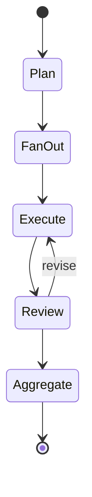

# Agent 模板：多 Agent 协作（Multi-Agent）

> 适用于「复杂任务拆解 + 编排 + 评审循环」场景。
> 典型：研究助手、代码生成、自动化办公 workflow。
>
> 📐 详细架构见 .claude/Claude.md §2 与 .harness/rules/工程结构规范.md

---

## 1. 角色模型

```mermaid
flowchart TB
    User[用户] --> Coordinator[Coordinator<br/>协调者]
    Coordinator --> Planner[Planner<br/>规划者]
    Coordinator --> Executor[Executor<br/>执行者]
    Coordinator --> Reviewer[Reviewer<br/>评审者]
    
    Planner --> Executor
    Executor --> Reviewer
    Reviewer --> Executor: 修订
    Reviewer --> Coordinator: 完成
```

| 角色 | 职责 | 实现 |
| --- | --- | --- |
| **Coordinator** | 接收用户 / 派发任务 / 收敛结果 | LangGraph 主图 |
| **Planner** | 拆解任务 / 排 DAG | LLM + Pydantic |
| **Executor** | 执行单个任务 / 调用工具 | Worker |
| **Reviewer** | 评审结果 / 触发修订 | Reflection |

---

## 2. 状态机



---

## 3. LangGraph 骨架

```python
class MultiAgentState(TypedDict):
    task: str
    plan: list[SubTask]
    results: dict[str, Any]
    review: list[ReviewNote]
    final_answer: str

def plan(state):
    pyd = PlanPrompt | llm.with_structured_output(Plan)
    plan = pyd.invoke(state["task"])
    return {"plan": plan.subtasks}

def fan_out(state):
    return [
        Send("execute", {"subtask": st, "id": i})
        for i, st in enumerate(state["plan"])
    ]

def execute(state):
    result = executor.run(state["subtask"])
    return {"results": {state["id"]: result}}

def review(state):
    notes = []
    for id, result in state["results"].items():
        n = reviewer.check(result)
        notes.append({"id": id, **n})
    # 未通过的返回重做
    revisions = [
        Send("execute", {"subtask": state["plan"][n["id"]], "id": n["id"], "feedback": n["feedback"]})
        for n in notes if not n["pass"]
    ]
    if revisions:
        return revisions
    return []  # 全过

def aggregate(state):
    return {"final_answer": aggregator.compose(state["results"])}
```

---

## 4. 编排范式选型

| 范式 | 适用 | 备注 |
| --- | --- | --- |
| **ReAct** | 工具调用为主 | 推理 ↔ 行动循环 |
| **Plan-and-Execute** | 长链任务 | 先做完整规划再执行 |
| **Reflection** | 输出需要校验 | LLM-as-a-Judge |
| **Multi-Agent Debate** | 决策类 | 多 LLM 投票 |
| **Hierarchical** | 复杂组织 | 多层编排（推荐本模板） |
| **Collaborative** | 同级协作 | 各自专长 |

---

## 5. 失败收敛

- 单 Executor 重试 ≤ 3 次
- 整体重试 ≤ 5 次
- 全部失败 → Coordinator 给出兜底回复 + 标记 `partial=True`

---

## 6. 工具与 HITL

| 操作类型 | 是否需要 HITL |
| --- | --- |
| 读操作（搜索 / 查询） | 否 |
| 写本地数据 | 否 |
| 写外部副作用（邮件 / 通知） | **是** |
| 支付 / 删除 | **是（双重审批）** |
| 创建 / 删除 Agent | **是** |

---

## 7. 测试要点

- Planner 拆解合理性
- Fan-Out 并发 vs 顺序
- Reviewer 评分一致性
- Aggregate 不丢信息
- 全部失败兜底
- HITL 路径

---

## 8. 监控

- 单任务调度的子 Agent 数
- 各 Executor 成功率
- Reviewer 通过率
- 单任务总成本
- 单任务总时长

---

## 9. 待补

- 引入 A2A / MCP 协议互通
- 跨项目 Agent 复用
- 跨项目共享状态

---

*版本：v1.1 — 2026-08-05 混合架构（agent-first）改造：路径 / 业务编排归属改为 agents/*
*上一版本：v1.0（2026-07-31 init）*
