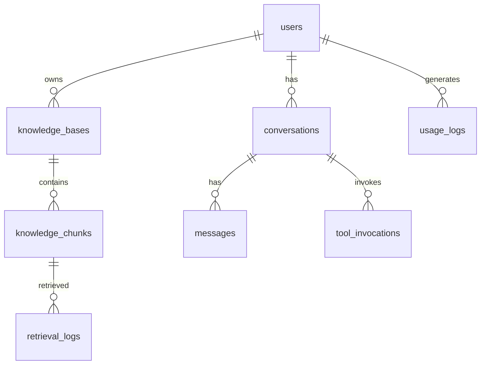

# 数据模型

> 本 Wiki 描述 AI Agent 项目的**核心表 Schema**（PostgreSQL）。
> 具体业务项目按需增删，**禁止**改下列基础表字段语义（改名/删字段需 Owner 决策）。

---

## 1. ER 概览



---

## 2. 表定义

### 2.1 `users`（用户）

```sql
CREATE TABLE users (
    id           UUID PRIMARY KEY DEFAULT gen_random_uuid(),
    external_id  TEXT UNIQUE NOT NULL,
    email        TEXT,
    display_name TEXT,
    metadata     JSONB DEFAULT '{}'::jsonb,
    created_at   TIMESTAMPTZ NOT NULL DEFAULT now(),
    updated_at   TIMESTAMPTZ NOT NULL DEFAULT now(),
    deleted_at   TIMESTAMPTZ
);
CREATE INDEX idx_users_external_id ON users(external_id);
```

### 2.2 `conversations`（会话）

```sql
CREATE TABLE conversations (
    id            UUID PRIMARY KEY DEFAULT gen_random_uuid(),
    user_id       UUID NOT NULL REFERENCES users(id),
    title         TEXT,
    bot_id        TEXT,
    kb_ids        TEXT[] NOT NULL DEFAULT '{}',
    metadata      JSONB DEFAULT '{}'::jsonb,
    created_at    TIMESTAMPTZ NOT NULL DEFAULT now(),
    updated_at    TIMESTAMPTZ NOT NULL DEFAULT now(),
    deleted_at    TIMESTAMPTZ
);
CREATE INDEX idx_conv_user_updated ON conversations(user_id, updated_at DESC);
```

### 2.3 `messages`（消息）

```sql
CREATE TABLE messages (
    id              BIGSERIAL PRIMARY KEY,
    conversation_id UUID NOT NULL REFERENCES conversations(id) ON DELETE CASCADE,
    role            TEXT NOT NULL CHECK (role IN ('system','user','assistant','tool')),
    content         TEXT NOT NULL,
    tool_calls      JSONB,
    tool_call_id    TEXT,
    metadata        JSONB DEFAULT '{}'::jsonb,
    token_usage     JSONB,
    created_at      TIMESTAMPTZ NOT NULL DEFAULT now()
);
CREATE INDEX idx_msg_conv_created ON messages(conversation_id, created_at);
```

### 2.4 `knowledge_bases`（知识库）

```sql
CREATE TABLE knowledge_bases (
    id              UUID PRIMARY KEY DEFAULT gen_random_uuid(),
    kb_id           TEXT UNIQUE NOT NULL,  -- 业务标识 KB{hex}
    user_id         UUID NOT NULL REFERENCES users(id),
    name            TEXT NOT NULL,
    description     TEXT,
    embedding_model TEXT NOT NULL DEFAULT 'text-embedding-3-small',
    chunk_size      INT NOT NULL DEFAULT 800,
    overlap         INT NOT NULL DEFAULT 100,
    metadata        JSONB DEFAULT '{}'::jsonb,
    created_at      TIMESTAMPTZ NOT NULL DEFAULT now(),
    updated_at      TIMESTAMPTZ NOT NULL DEFAULT now(),
    deleted_at      TIMESTAMPTZ
);
CREATE INDEX idx_kb_user ON knowledge_bases(user_id) WHERE deleted_at IS NULL;
```

### 2.5 `knowledge_chunks`（知识库切片 + 向量）

```sql
CREATE EXTENSION IF NOT EXISTS vector;

CREATE TABLE knowledge_chunks (
    id              BIGSERIAL PRIMARY KEY,
    kb_id           TEXT NOT NULL REFERENCES knowledge_bases(kb_id) ON DELETE CASCADE,
    file_id         TEXT NOT NULL,
    chunk_index     INT NOT NULL,
    content         TEXT NOT NULL,
    content_hash    TEXT NOT NULL,       -- sha256 for idempotency
    embedding       vector(1536),        -- 与 embedding_model 一致
    metadata        JSONB DEFAULT '{}'::jsonb,
    created_at      TIMESTAMPTZ NOT NULL DEFAULT now(),
    UNIQUE (kb_id, file_id, chunk_index),
    UNIQUE (kb_id, content_hash)
);

CREATE INDEX idx_kchunks_kb_file ON knowledge_chunks(kb_id, file_id);
CREATE INDEX idx_kchunks_emb ON knowledge_chunks USING hnsw (embedding vector_cosine_ops);
```

> 注：维度（`vector(N)`）必须与 `embedding_model` 一致。1536 适配 `text-embedding-3-small/large`、bge-large 需 1024。

### 2.6 `tool_invocations`（Agent 工具调用流水）

```sql
CREATE TABLE tool_invocations (
    id                BIGSERIAL PRIMARY KEY,
    conversation_id   UUID NOT NULL REFERENCES conversations(id) ON DELETE CASCADE,
    message_id        BIGINT REFERENCES messages(id),
    tool_name         TEXT NOT NULL,
    arguments         JSONB NOT NULL,
    idempotency_key   TEXT,
    result            JSONB,
    error             TEXT,
    requires_hitl     BOOLEAN NOT NULL DEFAULT false,
    hitl_approved_by  UUID REFERENCES users(id),
    hitl_approved_at  TIMESTAMPTZ,
    duration_ms       INT,
    created_at        TIMESTAMPTZ NOT NULL DEFAULT now()
);
CREATE INDEX idx_tool_conv ON tool_invocations(conversation_id, created_at);
```

### 2.7 `usage_logs`（LLM 用量与成本）

```sql
CREATE TABLE usage_logs (
    id                BIGSERIAL PRIMARY KEY,
    user_id           UUID REFERENCES users(id),
    conversation_id   UUID,
    request_id        UUID NOT NULL,
    provider          TEXT NOT NULL,
    model             TEXT NOT NULL,
    prompt_tokens     INT NOT NULL DEFAULT 0,
    completion_tokens INT NOT NULL DEFAULT 0,
    total_tokens      INT NOT NULL DEFAULT 0,
    cost_usd          NUMERIC(10, 6) DEFAULT 0,
    latency_ms        INT,
    created_at        TIMESTAMPTZ NOT NULL DEFAULT now()
);
CREATE INDEX idx_usage_created ON usage_logs(created_at);
CREATE INDEX idx_usage_user_created ON usage_logs(user_id, created_at DESC);
```

### 2.8 `retrieval_logs`（检索流水）

```sql
CREATE TABLE retrieval_logs (
    id              BIGSERIAL PRIMARY KEY,
    conversation_id UUID,
    kb_id           TEXT NOT NULL,
    query           TEXT NOT NULL,
    top_k           INT NOT NULL,
    retrieved_ids   BIGINT[],
    rerank_scores   REAL[],
    latency_ms      INT,
    created_at      TIMESTAMPTZ NOT NULL DEFAULT now()
);
```

---

## 3. 软删除

- 所有业务表都有 `deleted_at TIMESTAMPTZ`
- 查询统一走 `WHERE deleted_at IS NULL`
- 物理删除走后台定时任务（GDPR 合规）

---

## 4. 索引策略

| 表 | 索引类型 | 备注 |
| --- | --- | --- |
| `knowledge_chunks.embedding` | **HNSW**（vector_cosine_ops）| pgvector 推荐 |
| `messages (conversation_id, created_at)` | BTree | 对话消息时序 |
| `usage_logs (created_at)` | BTree | 时序聚合 |

---

## 5. 数据迁移

```bash
# 生成迁移
alembic revision --autogenerate -m "add_knowledge_chunks"

# 应用
alembic upgrade head

# 回滚
alembic downgrade -1
```

---

*版本：v1.0 — 2026-07-31*
