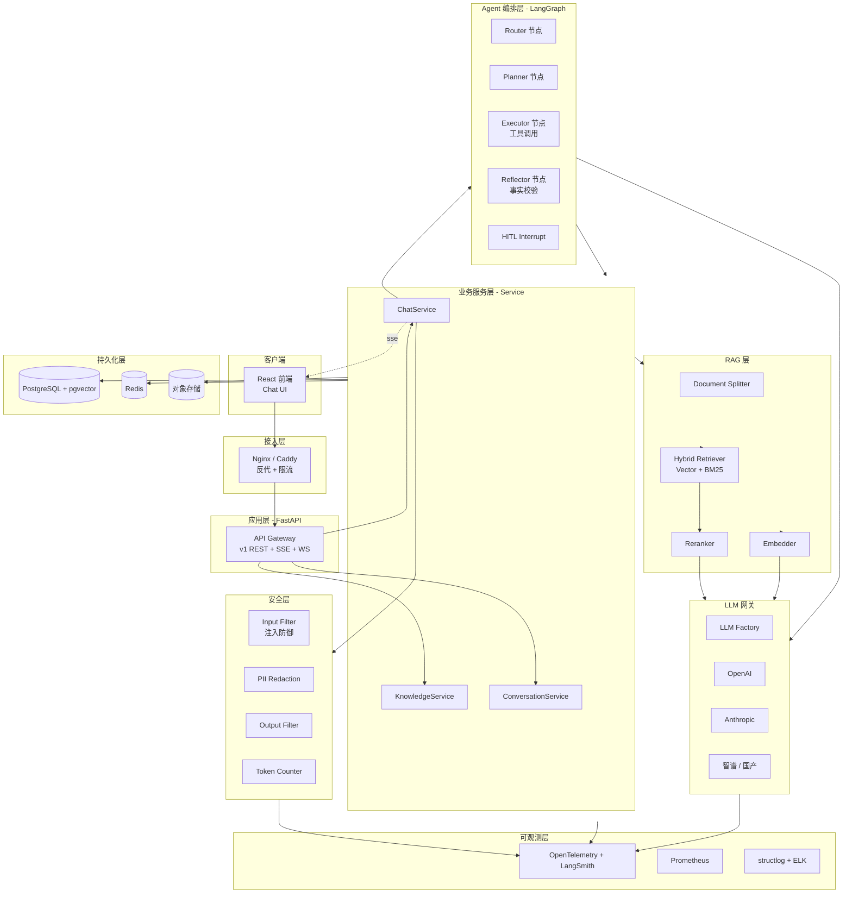

# 架构设计

> 本文件描述 AI Agent 项目（智能客服 / 专家系统）的**目标架构**。
> 所有具体业务项目以本架构为基线，按需裁剪。

---

## 1. 总体架构



---

## 2. 分层职责

| 层 | 职责 | 关键指标 |
| --- | --- | --- |
| **接入层** | 限流 / TLS / 反代 / 灰度 | QPS / TLS 握手 / 503 比例 |
| **API 网关** | 路由 / 参数校验 / 响应包装 | P95 延迟 |
| **Agent 编排** | 状态机 / 工具调度 / 反思循环 | 单轮 turn 数 / HITL 触发率 |
| **业务服务** | 事务 / 领域逻辑 | 业务正确性 |
| **RAG** | 切分 / 召回 / 重排 | Recall@10 / nDCG@10 |
| **Guardrail** | 输入/输出审核 | 拦截率 / 误判率 |
| **LLM 网关** | 统一封装 / 限流 / 降级 | 成功率 / Token 成本 |
| **持久层** | OLTP / 向量 / 缓存 / 文件 | DB QPS / 向量召回延迟 |

---

## 3. 关键数据流

### 3.1 用户提问（chat 流）

```
1. FE POST /api/v1/chat（sse=true） →
2. ChatService.chat() →
3. ConversationService.get_history（Redis 缓存） →
4. Guardrail.input_filter.detect_injection() →
5. Guardrail.pii.redact() →
6. KbService.search_by_user_kb_ids(query) →
   ↳ HybridRetriever.vector_search() + bm25_search()
   ↳ Reranker.rerank() → topK=5
7. PromptLoader.load("chat_system", version=stable)
8. TokenCounter.check_before_call()
9. LLMFactory.get_llm().ainvoke(messages)
10. Guardrail.output_filter.check()
11. ConversationService.append()
12. SSE 推回 FE
13. TokenCounter.track(usage)
14. structlog.info("chat.completed", ...)
```

### 3.2 文档入库（RAG 流）

```
1. FE POST /api/v1/knowledge/upload (multipart) →
2. KbService.upload() →
3. 落 Obj → 写 File 表 status=gray →
4. SSE 端点 /api/v1/knowledge/{file_id}/status 推送进度 →
5. 后台 Worker (Celery beat / asyncio.create_task):
   a. Splitter.split(file_bytes) → chunks
   b. Embedder.embed_batch(chunks, batch=32) → vectors
   c. PG.execute("INSERT INTO knowledge_chunks (...)") ON CONFLICT DO NOTHING
   d. Reranker.fit_top_documents（可选）
   e. update status=green
```

---

## 4. 高可用设计

| 风险 | 缓解 |
| --- | --- |
| LLM API 中断 | 模型降级链 R14 + 熔断 + 兜底回复 |
| 数据库主从切换 | pgvector 单写多读 + read replica |
| 向量检索延迟 | Redis 缓存 topK（30s TTL） |
| Worker 崩溃 | Celery acks_late + 重试 + DLQ |
| 大文件 OOM | 流式 split + chunk_size 上限 |

---

## 5. 安全设计

- L4 限流：Nginx / slowapi
- L7 WAF：注入 / 越权检测
- 数据库：行级权限（user_id 隔离）
- Prompt 注入：Guardrail.input_filter + 物理隔离
- PII：Guardrail.pii（输入 / 日志 / 审计 三处）
- 审计日志：所有写操作入 audit_logs

---

## 6. 演进路线

| 阶段 | 重点 |
| --- | --- |
| v0.1 当前 | PoC + Harness 完备 + 单 Agent |
| v0.2 | RAG + 知识库 + 上线 |
| v0.3 | 多 Agent 编排 + 工作流引擎 |
| v1.0 | 多租户 + 监控完备 + SLA |

---

*版本：v1.0 — 2026-07-31*
